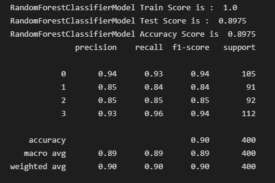

# Data Mining Final Project

## Mobile Price Classification

outline
- [Introduction](#introduction)
- [Dataset](#dataset)
- [Data preprocessing](#data-preprocessing)
- [Using the data mining module](#using-the-data-mining-module)
- [Change control parameters](#change-control-parameters)
- [Evaluate](#evaluate)
- [Results and discussion](#results-and-discussion)
- [How to run](#how-to-run)

## Introduction

- Goal
    - When consumers purchase mobile phones, there are many factors that will affect consumers' willingness to purchase mobile phones, such as screen size, camera specifications, storage capacity, etc.

    - It is also possible to analyze which specifications or components companies will use to determine the price of mobile phones when setting mobile phone prices.

## Dataset

- Dataset name: [Mobile Price Classification](https://www.kaggle.com/datasets/iabhishekofficial/mobile-price-classification?datasetId=11167&sortBy=voteCount&select=train.csv)
- Dataset source: Kaggle
- Number of data: 2000
- Data description (21 features in total):
    - Nominal
        - blue: whether to support bluetooth
        - dual_sim: whether to support dual sim cards
        - four_g: whether to support 4G
        - three_g: whether to support 3G
        - touch_screen: whether it is a touch screen
        - wifi: whether to support wifi
    - Ordinal
        - price_range: price range (0~3)
    - Interval & Ratio
        - battery_power: battery capacity
        - clock_speed: Microprocessor instruction execution speed
        - fc: front camera megapixels
        - int_memory: memory size (GB)
        - m_dep: mobile phone thickness (cm)
        - mobile_wt: mobile phone weight
        - n_cores: number of processor cores
        - pc: Main camera megapixels
        - px_height: high resolution
        - px_width: resolution width
        - ram: random access memory size (MG)
        - sc_h: screen length
        - sc_w: screen width
        - talk_time: the maximum battery life during a call

## Data preprocessing

- After checking that there are no missing values, a few features have outliers, but they do not affect the whole, so no special treatment is done.

- The more expensive the phone (price_range=3), the lighter it is.

- In high-end models (price_range=3), larger screens are preferred. As the price increases, the screen size also grows slightly

- Use corr() to calculate the correlation coefficient between each feature, and use seaborn.heatmap() to visualize the result. Here, the top 10 important features are used to calculate the correlation coefficient. Through the heatmap, you can see the correlation between each feature and the price range. In the subsequent analysis, the correlation coefficient with the price range will be used as the basis for screening important features. In addition, it can be found that there is a fairly high correlation between variables, such as fc and pc (0.64), px_width and px_height (0.51), four_g and three_g (0.58). For these highly correlated features, several of them are combined into a new feature.

- Ｍerge features
    - sc_h + sc_w = sc_size
    
    - px_height + px_width = pixels
    

## Using the data mining module

Random forest is a classification and regression algorithm, which is a model composed of many decision trees. In a random forest, each decision tree is trained on a randomly selected subset of the training data
here. Each decision tree has its own classification or prediction result, and the final classification or prediction result of random forest is the majority decision of the results of all decision trees.
In this data set, the random forest modeling process is as follows:
1. Randomly extract a feature from the training set, such as the memory of a mobile phone, and use this feature to build a decision tree.
2. Repeat step 1 to build multiple decision trees.
3. For new samples or data, input it into each decision tree to get the prediction result of each tree.
4. Count the prediction results of all decision trees together, such as taking the average or decision majority, to obtain the final prediction result.

## Change control parameters

- It is hoped that the fit ability of the model can be improved by changing the parameters.

- n_estimators: the number of trees in the forest (number of base estimators)
    - 1. Generally, the larger the value, the better the model effect. But any model has a decision boundary. When its value reaches a certain level, the accuracy often does not rise or begins to fluctuate. .
    - 2. The larger the value of n_estimators, the longer the training time

- Result of change parameters

    - When n_estimators are around 200, it can no longer increase, so the optimal n_estimators = 200.

    - 

- GridSearch
    - Scikit-Learn also provides the GridSearch method. After the parameters are set, the best combination of parameters can be found through parallel operations.
    - 

    - 

## Evaluate

- Without data preprocessing, the obtained score is 0.8975

- After data pre-processing, the obtained score is 0.8825

- Group by category of data

- Classify the features in the training data, and finally get all the scores through the random forest, and present them with a bar graph.
- Internal Specifications category has the highest accuracy

- Classify according to the correlation coefficient

If correlation is used as feature classification, it can be divided into four groups. The accuracy rate of each category can be obtained through random forest. The correlation coefficient > 0.04 is the highest. It can be seen that if there is a group with memory, the score will be higher. relatively high. Display memory is an important factor for mobile phone prices.

## Results and discussion

- Mobile phones are electronic products that we often use. When we need to buy a new mobile phone or when a company is doing market research, it is necessary to determine the price based on the characteristics of each mobile phone.

    - This data set uses random forest to classify data. Although the accuracy of random forest is slightly lower than that of some models in some cases, its advantage is that it can handle a large number of input variables. For example, when new data comes in, it can be done directly. Classification can be performed without retraining the model, and its accuracy can be maintained in the case of missing or incomplete data.

    - From the above experiments, it can be concluded that the optimal value of random forest n_estimators is 200

    - Evaluate model accuracy and performance using confusion matrix

- It can also be seen from the figure (important features obtained after random forest):

    - The memory is directly proportional to the price of the mobile phone. When the memory capacity increases, the price of the mobile phone will also increase.

    - Memory, battery power, and camera pixels are important factors in determining the price range of a mobile phone

## How to run

- To execute the ipynb file, you need to install the packages in `requirements.txt` first, then open jupyter notebook through vscode or use google's colab to open the ipynb file.
    - The package installation command is: `pip install -r requirements.txt`

- If you only want to see the results, you can open the `mobile.html`, the content of which is consistent with the mobile.ipynb file.